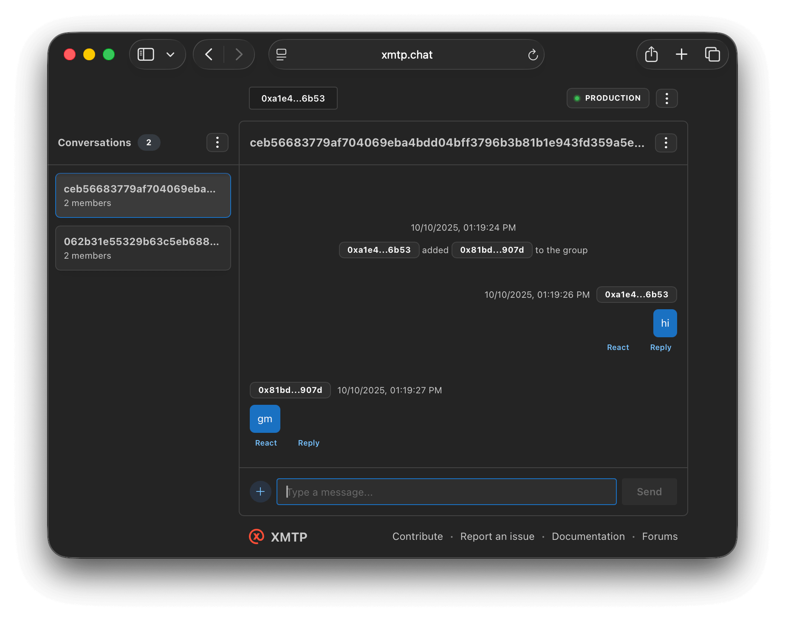

# GM example

This agent replies `gm`



### Requirements

- Node.js v20 or higher
- Yarn v4 or higher
- Docker (optional, for local network)

### Environment variables

To run your XMTP agent, you must create a `.env` file with the following variables:

```bash
XMTP_WALLET_KEY= # the private key of the wallet
XMTP_DB_ENCRYPTION_KEY= # encryption key for the local database
XMTP_ENV=dev # local, dev, production
```

### Run the agent

```bash
# git clone repo
git clone https://github.com/ephemeraHQ/xmtp-agent-examples.git
# go to the folder
cd xmtp-agent-examples
cd examples/xmtp-gm
# install packages
yarn
# generate random xmtp keys (optional)
yarn gen:keys
# run the example
yarn dev
```
